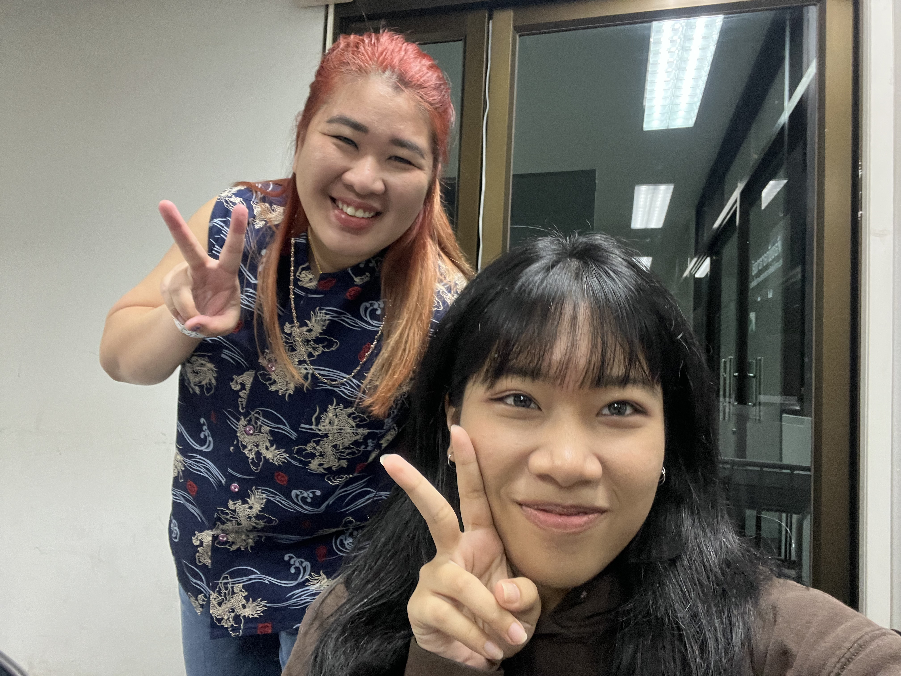

# mmkamisa.github.io

- Full name(Eng) : Sarita Prompattanakul
- Full name(TH) : สริตา พร้อมพัฒนกุล
- Nickname : มะหมี่ยว
- Guest : พี่เจล
- Sustainability
  - GPT chat : คุณลักษณะที่เกี่ยวกับความยั่งยืน(Sustainability) หมายถึง คุณสมบัติที่เกี่ยวกับความยั่งยืนของระบบซอฟต์แวร์หรือผลิตภัณฑ์ที่ให้ความสำคัญกับผลกระทบทางสิ่งแวดล้อมและความยั่งยืนในระยะยาว 
  - Google Bard : คุณภาพการคงอยู่ได้ (Sustainability) คือคุณลักษณะคุณภาพที่ระบบซอฟต์แวร์ควรมี เพื่อให้สามารถใช้งานได้อย่างมีประสิทธิภาพในระยะยาว 
